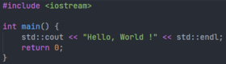

[Wikipedia C++](https://fr.wikipedia.org/wiki/C%2B%2B)

# C++
***C++*** est un [langage de programmation](https://fr.wikipedia.org/wiki/Langage_de_programmation) compilé permettant la programmation sous de multiples [paradigmes](https://fr.wikipedia.org/wiki/Paradigme_(programmation)), dont la [programmation procédurale](https://fr.wikipedia.org/wiki/Programmation_proc%C3%A9durale), la [programmation orientée objet](https://fr.wikipedia.org/wiki/Programmation_orient%C3%A9e_objet) et la [programmation générique](https://fr.wikipedia.org/wiki/G%C3%A9n%C3%A9ricit%C3%A9). Ses bonnes performances, et sa compatibilité avec le C en font un des langages de programmation les plus utilisés dans les applications où la performance est critique.

Créé initialement par [Bjarne Stroustrup](https://fr.wikipedia.org/wiki/Bjarne_Stroustrup) dans les années 1980, le langage C++ est aujourd'hui [normalisé](https://fr.wikipedia.org/wiki/Norme_et_standard_techniques) par l'[ISO](https://fr.wikipedia.org/wiki/Organisation_internationale_de_normalisation). Sa première normalisation date de [1998](https://fr.wikipedia.org/wiki/1998) (ISO/CEI 14882:1998), ensuite amendée par l'erratum technique de [2003](https://fr.wikipedia.org/wiki/2003) (ISO/CEI 14882:2003). Une importante mise à jour a été ratifiée et publiée par l'ISO en septembre 2011 sous le nom de ISO/IEC 14882:2011, ou [C++11](https://fr.wikipedia.org/wiki/C%2B%2B11)<sup>[3](https://fr.wikipedia.org/wiki/C%2B%2B#cite_note-3)</sup>. Depuis, des mises à jour sont publiées régulièrement : en 2014 (ISO/CEI 14882:2014, ou [C++14](https://fr.wikipedia.org/wiki/C%2B%2B14)<sup>[4](https://fr.wikipedia.org/wiki/C%2B%2B#cite_note-4)</sup>), en 2017 (ISO/CEI 14882:2017, ou [C++17](https://fr.wikipedia.org/wiki/C%2B%2B17)<sup>[5](https://fr.wikipedia.org/wiki/C%2B%2B#cite_note-5)</sup>) puis en 2020 (ISO/IEC 14882:2020, ou [C++20](https://fr.wikipedia.org/wiki/C%2B%2B20)<sup>[6](https://fr.wikipedia.org/wiki/C%2B%2B#cite_note-6)</sup>).


## Programmation orientée objet
Le langage **C++ utilise** les concepts de la [programmation orientée objet](https://fr.wikipedia.org/wiki/Programmation_orient%C3%A9e_objet) et permet entre autres :

1. la création de [classes](https://fr.wikipedia.org/wiki/Classe_(informatique)) ;
    1. [l'encapsulation](https://fr.wikipedia.org/wiki/Encapsulation_(programmation)) ;
    2. des relations entre les [classes](https://fr.wikipedia.org/wiki/Classe_(informatique)) :
        1. la [composition de classes](https://fr.wikipedia.org/wiki/Classe_(informatique)) ([composition dans un diagramme de classes](https://fr.wikipedia.org/wiki/Diagramme_de_classes#Composition)),
        2. [l'association de classes](https://fr.wikipedia.org/w/index.php?title=Association_de_classes&action=edit&redlink=1) [(en)](https://en.wikipedia.org/wiki/Association_(object-oriented_programming)) ([association dans un diagramme de classes](https://fr.wikipedia.org/wiki/Diagramme_de_classes#Association)),
        3. l'agrégation de classes ([agrégation dans un diagramme de classes](https://fr.wikipedia.org/wiki/Diagramme_de_classes#Agr%C3%A9gation)),
        4. la dépendance ([dépendance dans un diagramme de classes](https://fr.wikipedia.org/wiki/Diagramme_de_classes#D%C3%A9pendance)),
        5. l'[héritage](https://fr.wikipedia.org/wiki/H%C3%A9ritage_(informatique)) simple et [multiple](https://fr.wikipedia.org/wiki/H%C3%A9ritage_multiple) ([héritage dans un diagramme de classes](https://fr.wikipedia.org/wiki/Diagramme_de_classes#H%C3%A9ritage)) ;
2. le [polymorphisme](https://fr.wikipedia.org/wiki/Polymorphisme_(informatique)) ;
3. l'[abstraction](https://fr.wikipedia.org/wiki/Abstraction_(informatique)) ;
4. la [généricité](https://fr.wikipedia.org/wiki/G%C3%A9n%C3%A9ricit%C3%A9) ;
5. la [méta-programmation](https://fr.wikipedia.org/wiki/M%C3%A9taprogrammation).

## << *Hello, World* >>
Voici l'exemple de [Hello world](https://fr.wikipedia.org/wiki/Hello_world) donné dans The C++ Programming Language, Third Edition11 de [Bjarne Stroustrup](https://fr.wikipedia.org/wiki/Bjarne_Stroustrup) :
```
#include<iostream>

int main()
{
    std::cout << "Hello, new world!\n";
}
```
>Dans l'exemple ci-dessus, le code source `std::cout << "Hello, new world!\n" `envoie la chaîne de caractères "Hello, new world!\n" à l'objet global cout, défini dans l'espace de noms standard std, grâce à l'opérateur << de cout.



***

## Outils de développement
Un programme C++ peut être produit avec des outils qui automatisent le processus de construction. Les plus utilisés sont :

* [make](https://fr.wikipedia.org/wiki/Make) ;
* [Ant](https://fr.wikipedia.org/wiki/Apache_Ant) (génération portable en XML) ;
* [SCons](https://fr.wikipedia.org/wiki/SCons) (génération portable en Python) ;
* [CMake](https://fr.wikipedia.org/wiki/CMake) (génération de [Makefile](https://fr.wikipedia.org/wiki/Make) portable) ;
* [Bazel](https://fr.wikipedia.org/wiki/Bazel_(logiciel)).

[//]: # (Voici mon commentaire: Je constate que le language code Markdown ainsi que le logiciel Visual Studio Code sont de très bon outils de travail)